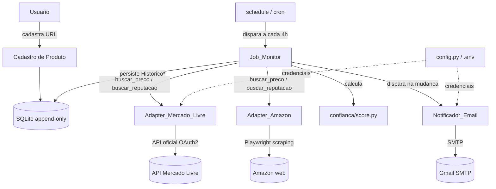
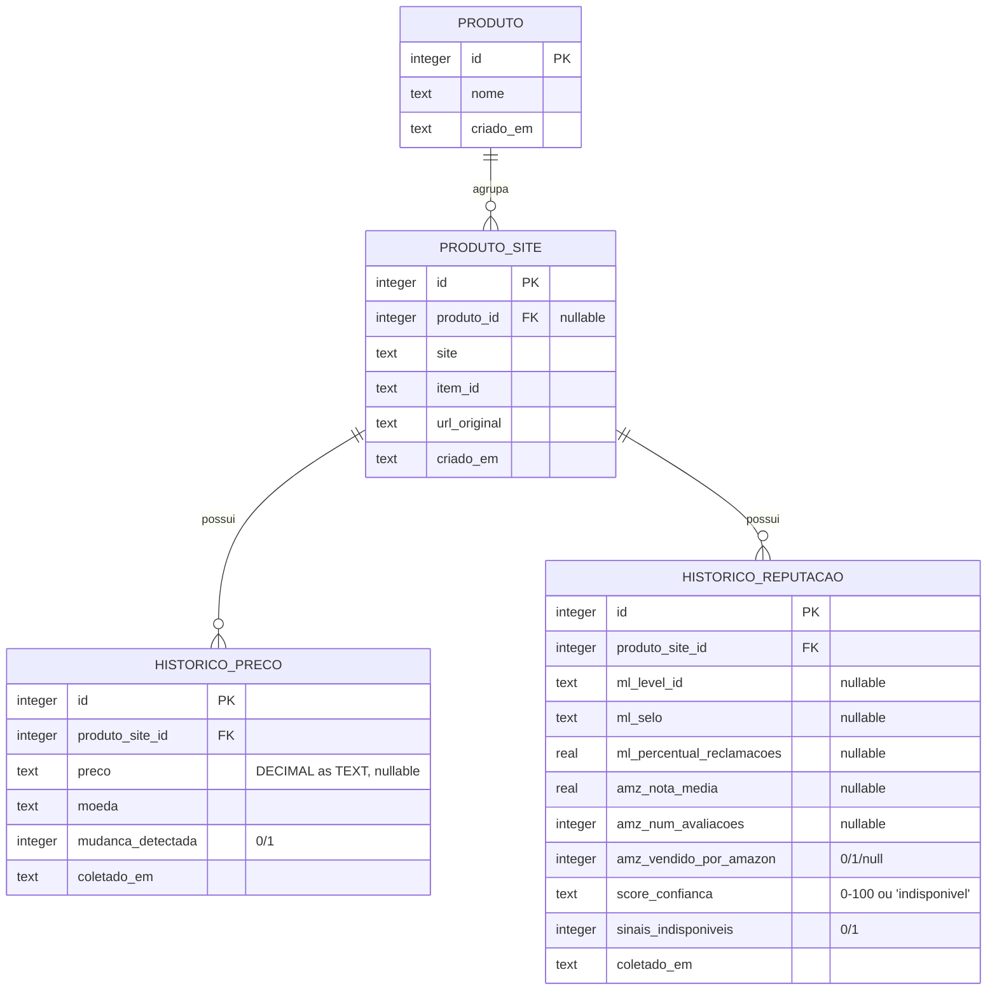
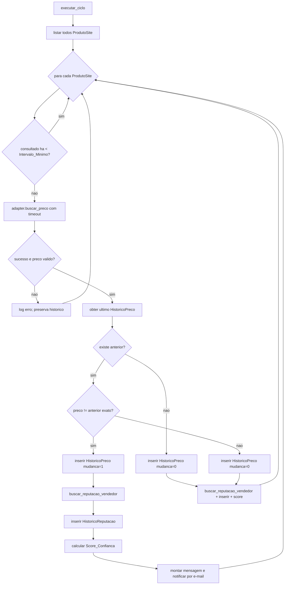

# Documento de Design — Rastreador de Preços com IA (MVP)

## Overview

O Rastreador de Preços (MVP) é uma aplicação Python 3.11+ de usuário único que
monitora periodicamente produtos cadastrados no Mercado Livre e na Amazon,
mantém um histórico de preços e reputação append-only em SQLite, detecta
mudanças de preço e notifica o usuário via e-mail (SMTP/Gmail), exibindo
também um score de confiança determinístico do vendedor.

O design segue três princípios centrais derivados dos steering docs
(`product.md`, `tech.md`, `structure.md`):

1. **Isolamento por site via adapters.** Cada site é acessado por um adapter
   independente que implementa uma interface comum. Nenhum adapter importa
   outro. Adapters apenas *buscam dados*; eles não decidem se uma notificação
   deve ocorrer. (tech.md, structure.md)
2. **Histórico append-only.** Preço e reputação nunca são sobrescritos; cada
   consulta gera um novo registro com timestamp. Isso preserva a série
   histórica e mantém o schema portável para uma futura migração a PostgreSQL.
   (tech.md — banco de dados)
3. **Extensibilidade para o modo "caçador de pechincha".** A interface do
   adapter e o modelo de dados são genéricos o suficiente para acomodar, no
   futuro, marketplaces de usados (OLX, Facebook Marketplace) reutilizando o
   mesmo banco e o mesmo notificador, sem reescrita. (product.md — Expansão
   Futura)

Este design cobre os 7 requisitos do `requirements.md`:
cadastro de produto (R1), agrupamento entre sites (R2), monitoramento periódico
(R3), detecção de mudança (R4), notificação por e-mail (R5), reputação do vendedor
e score (R6) e configuração/segurança de credenciais (R7).

### Notas de pesquisa que informam o design

- **Mercado Livre — reputação.** O recurso `GET /users/{user_id}` expõe o
  objeto `seller_reputation` contendo `level_id` (níveis discretos, tipicamente
  na faixa `1_red` … `5_green`), `power_seller_status` (que mapeia para os
  selos MercadoLíder / MercadoLíder Gold / MercadoLíder Platinum ou ausência) e
  `transactions.ratings` com percentuais positivo/neutro/negativo. O percentual
  de reclamações do R6.1 é derivado do percentual negativo (`negative`), quando
  disponível (na prática `ratings` costuma vir vazio → indisponível). O
  `seller_id` do vendedor é obtido em `GET /products/{product_id}/items`
  (o adapter opera por catálogo — ver abaixo).
- **Mercado Livre — preço (estratégia de CATÁLOGO).** O endpoint de anúncio
  individual `GET /items/{item_id}` retorna **403** com o escopo de leitura
  pública do projeto (confirmado empiricamente), e os links são de catálogo
  (`/p/<PRODUCT_ID>`). O adapter usa `GET /products/{product_id}/items` para
  listar os anúncios (`price`, `seller_id`, `condition`) e escolhe o menor
  preço entre anúncios `new` de vendedor confiável (`level_id` em
  {`4_light_green`,`5_green`} OU com selo MercadoLíder). O nome do produto vem
  de `GET /products/{product_id}`. NÃO se usa `/items/{id}` nem `/sale_price`.
  <!-- nota historica: o endpoint exato foi
  confirmado contra a documentação oficial atual antes da implementação**, pois
  a API evolui; o adapter encapsula essa decisão em um único método interno para
  que a troca do endpoint não afete o restante do sistema.
- **Mercado Livre — webhook `items_prices`.** Assinar o tópico `items_prices`
  permitiria receber mudanças de preço em vez de fazer polling. Para o MVP
  optamos por **polling** (mais simples de operar em VPS/Raspberry Pi, sem
  necessidade de endpoint HTTP público exposto). O webhook fica documentado como
  *enhancement* opcional futuro; a arquitetura de detecção de mudança em
  `jobs/monitor.py` é agnóstica à origem do preço, então adotar o webhook depois
  não exige reescrever a detecção.
- **Amazon — scraping.** O conteúdo de preço/avaliações é renderizado via JS,
  então usamos Playwright. Os seletores de preço, nota, número de avaliações e
  responsável pela venda/entrega são frágeis por natureza; o adapter os
  centraliza e trata ausência de seletor como sinal indisponível, não como
  crash.

## Architecture

### Visão de alto nível



### Responsabilidades dos componentes

| Componente | Módulo | Responsabilidade |
|---|---|---|
| Cadastro de Produto | `src/adapters/*` (parsing de URL) + `src/db` | Extrair site + item_id/ASIN de uma URL, validar, evitar duplicatas, persistir `ProdutoSite`. (R1) |
| Modelo de dados | `src/db/models.py`, `src/db/database.py` | Entidades e acesso ao SQLite; garante append-only e agrupamento (R2, R3.2, R6.3). |
| Adapter comum | `src/adapters/base.py` | Interface `buscar_preco` / `buscar_reputacao_vendedor`, tipos `PrecoResult` / `ReputacaoResult` e parsing de URL. |
| Adapter Mercado Livre | `src/adapters/mercado_livre.py` | API oficial via OAuth2; preço e reputação; refresh de token. (R6.1, R7.4) |
| Adapter Amazon | `src/adapters/amazon.py` | Scraping via Playwright com rate limiting e tratamento de bloqueio/CAPTCHA. (R3.7, R6.2) |
| Job_Monitor | `src/jobs/monitor.py` | Orquestra o ciclo: itera `ProdutoSite`, respeita intervalo/timeout, persiste histórico, detecta mudança, calcula score, dispara notificação, isola erros. (R3, R4, R6) |
| Score de confiança | `src/confianca/score.py` | Fórmula determinística 0–100 por site, sem LLM. (R6.4, R6.5) |
| Notificador E-mail | `src/notificacao/email.py` | Monta e envia mensagem via SMTP/Gmail; retry/timeout/fallback. (R5) |
| Configuração | `src/config.py` | Lê variáveis de ambiente obrigatórias; falha na inicialização se faltar. (R7) |

### Regra arquitetural de separação (R3, R4)

A **decisão de notificar** vive exclusivamente em `jobs/monitor.py`. Os adapters
retornam dados brutos (`PrecoResult`, `ReputacaoResult`) e não têm conhecimento
de histórico, comparação ou notificação. Isso mantém os adapters testáveis com
respostas mockadas e permite trocar a origem do dado (ex.: polling → webhook)
sem tocar na lógica de detecção.

### Extensibilidade futura

O modo "caçador de pechincha" (usados) é acomodado sem reescrita porque:
- Novos sites entram apenas como novos módulos em `src/adapters/` implementando a
  mesma interface `BaseAdapter`.
- O campo `site` em `ProdutoSite` é uma string aberta (não um enum fechado no
  banco), permitindo `"olx"`, `"facebook_marketplace"` etc.
- `HistoricoPreco` e `HistoricoReputacao` são genéricos e reusáveis. A lógica de
  "preço médio de mercado / anúncio suspeito" seria um novo job irmão de
  `monitor.py` consumindo os mesmos históricos.

## Components and Interfaces

### Interface comum de adapter (`src/adapters/base.py`)

```python
from __future__ import annotations
from abc import ABC, abstractmethod
from dataclasses import dataclass
from decimal import Decimal
from enum import Enum
from typing import Optional


class Site(str, Enum):
    MERCADO_LIVRE = "mercado_livre"
    AMAZON = "amazon"
    # Futuro: OLX = "olx", FACEBOOK_MARKETPLACE = "facebook_marketplace"


@dataclass(frozen=True)
class ItemRef:
    """Resultado do parsing de uma URL de anúncio."""
    site: Site
    item_id: str          # "MLB..." no ML, ASIN de 10 chars na Amazon
    url_original: str


@dataclass(frozen=True)
class PrecoResult:
    sucesso: bool
    preco: Optional[Decimal] = None       # None quando indisponível/erro
    moeda: str = "BRL"
    erro: Optional[str] = None            # motivo quando sucesso=False
    nome_produto: Optional[str] = None    # título do anúncio, se obtido


@dataclass(frozen=True)
class ReputacaoResult:
    sucesso: bool
    # Campos comuns; cada adapter preenche o subconjunto do seu site.
    # Mercado Livre:
    ml_level_id: Optional[str] = None            # ex.: "5_green"
    ml_selo_mercadolider: Optional[str] = None   # "ausente"|"mercadolider"|"gold"|"platinum"
    ml_percentual_reclamacoes: Optional[float] = None  # 0..100
    # Amazon:
    amz_nota_media: Optional[float] = None       # 0.0..5.0
    amz_num_avaliacoes: Optional[int] = None     # >= 0
    amz_vendido_por_amazon: Optional[bool] = None
    # Comum:
    sinais_indisponiveis: bool = False           # True se algum sinal faltou
    erro: Optional[str] = None


class BaseAdapter(ABC):
    """Interface comum. Nenhum adapter importa outro adapter."""

    site: Site

    @staticmethod
    @abstractmethod
    def parse_url(url: str) -> Optional[ItemRef]:
        """Extrai (site, item_id) de uma URL. Retorna None se não for deste site
        ou se o identificador não puder ser extraído."""

    @abstractmethod
    def buscar_preco(self, produto_site_id: str) -> PrecoResult:
        ...

    @abstractmethod
    def buscar_reputacao_vendedor(self, produto_site_id: str) -> ReputacaoResult:
        ...
```

Notas:
- `buscar_preco` / `buscar_reputacao_vendedor` **nunca lançam** por falha de
  rede/parsing: retornam `sucesso=False` com `erro` preenchido, garantindo o
  isolamento exigido em R3.3 e R6.6.
- `parse_url` é `@staticmethod` para poder ser usada no cadastro (R1) sem
  instanciar credenciais.

### Adapter Mercado Livre (`src/adapters/mercado_livre.py`)

- **Parsing (R1.1):** aceita URLs de `mercadolivre.com.br` / `mercadolibre` e
  extrai o item_id via regex `MLB\d+` (padrão "MLB" + dígitos). Normaliza
  para maiúsculas. Retorna `None` se não casar.
- **Preço (R3.1):** chama `GET /items/{item_id}` para obter `title`,
  `seller_id` e preço base; usa o endpoint dedicado de preço de venda
  (`/sale_price` ou equivalente — *confirmar na doc oficial*) para o preço
  efetivo. Encapsulado em `_obter_preco_venda(item_id)`.
- **Reputação (R6.1):** `GET /users/{seller_id}` → `seller_reputation`.
  Mapeia `level_id`, `power_seller_status` → selo, e `transactions.ratings.negative`
  (fração 0..1) × 100 → percentual de reclamações.
- **OAuth (R7.4/R7.5):** ver seção "Fluxo OAuth do Mercado Livre".

### Adapter Amazon (`src/adapters/amazon.py`)

- **Parsing (R1.2):** extrai o ASIN (exatamente 10 caracteres alfanuméricos)
  de padrões como `/dp/ASIN`, `/gp/product/ASIN`. Regex `[A-Z0-9]{10}`
  âncorada ao segmento da URL. Retorna `None` se não encontrar/validar.
- **Preço + reputação (R6.2):** abre a página com Playwright (headless),
  extrai preço atual, nota média (estrelas), número de avaliações e
  responsável pela venda/entrega. Seletores centralizados; ausência → sinal
  indisponível.
- **Rate limiting / bloqueio (R3.7):** ver seção "Rate limiting e bloqueio da
  Amazon".

### Notificador E-mail (`src/notificacao/email.py`)

Função pública `enviar_notificacao(mensagem, remetente, senha_app,
destinatario, produto_site_id=None, ...) -> ResultadoEnvio`. Monta um
`EmailMessage` de texto simples e o envia por SMTP/Gmail (`smtp.gmail.com:587`,
STARTTLS) com `smtplib`. Ver seção "Notificação por e-mail".

### Configuração (`src/config.py`)

Lê as 7 variáveis obrigatórias (R7.1) de ambiente. Na inicialização (R7.3),
valida presença/não-vazio de cada uma; se faltar, registra em log qual chave
está ausente e interrompe. Nenhum valor default embutido.

## Data Models

### Diagrama de entidades



Relacionamentos: `Produto` 1..* `ProdutoSite`; `ProdutoSite` 1..* `HistoricoPreco`;
`ProdutoSite` 1..* `HistoricoReputacao`. Um `ProdutoSite` pode existir com
`produto_id = NULL` (single-site, sem agrupamento) e ser associado depois (R2).

### Schema SQLite

```sql
CREATE TABLE produto (
    id         INTEGER PRIMARY KEY AUTOINCREMENT,
    nome       TEXT NOT NULL,
    criado_em  TEXT NOT NULL          -- ISO-8601 UTC
);

CREATE TABLE produto_site (
    id            INTEGER PRIMARY KEY AUTOINCREMENT,
    produto_id    INTEGER REFERENCES produto(id),   -- NULL = single-site
    site          TEXT NOT NULL,                     -- string aberta p/ extensão
    item_id       TEXT NOT NULL,                     -- MLB... ou ASIN
    url_original  TEXT NOT NULL,
    criado_em     TEXT NOT NULL,
    UNIQUE (site, item_id)                           -- impede duplicata (R1.5)
);

-- Append-only: sem UPDATE/DELETE em uso normal.
CREATE TABLE historico_preco (
    id                INTEGER PRIMARY KEY AUTOINCREMENT,
    produto_site_id   INTEGER NOT NULL REFERENCES produto_site(id),
    preco             TEXT,                 -- Decimal serializado; NULL = indisponível
    moeda             TEXT NOT NULL DEFAULT 'BRL',
    mudanca_detectada INTEGER NOT NULL DEFAULT 0,   -- 0/1
    coletado_em       TEXT NOT NULL         -- ISO-8601 UTC (timestamp da consulta)
);
CREATE INDEX idx_hist_preco_ps_ts
    ON historico_preco(produto_site_id, coletado_em);

CREATE TABLE historico_reputacao (
    id                        INTEGER PRIMARY KEY AUTOINCREMENT,
    produto_site_id           INTEGER NOT NULL REFERENCES produto_site(id),
    ml_level_id               TEXT,
    ml_selo                   TEXT,
    ml_percentual_reclamacoes REAL,
    amz_nota_media            REAL,
    amz_num_avaliacoes        INTEGER,
    amz_vendido_por_amazon    INTEGER,      -- 0/1/NULL
    score_confianca           TEXT,         -- "0".."100" ou "indisponivel"
    sinais_indisponiveis      INTEGER NOT NULL DEFAULT 0,
    coletado_em               TEXT NOT NULL
);
CREATE INDEX idx_hist_rep_ps_ts
    ON historico_reputacao(produto_site_id, coletado_em);
```

Decisões:
- **Preço como `TEXT`** representando `Decimal` para preservar valor monetário
  exato e permitir comparação sem arredondamento (R4.2). Nunca `REAL` para
  preço.
- **Timestamps ISO-8601 em UTC** como `TEXT`, portável para PostgreSQL.
- **Append-only** garantido por convenção de acesso (a camada `database.py`
  expõe apenas `inserir_*` e `listar/obter_ultimo`, sem `update`/`delete` de
  histórico). O "último preço" é o registro de maior `coletado_em` (R4.1); em
  empate de timestamp, o de maior `id` (ordem de inserção).
- **`site` como string aberta** para acomodar OLX/Facebook no futuro sem
  migração.

## Fluxo do Job_Monitor (`src/jobs/monitor.py`)

O agendador (`schedule` a cada 4h por padrão, R3.5) chama `executar_ciclo()`.
O ciclo isola erros por `ProdutoSite`: uma falha em um item nunca interrompe os
demais (R3.3, R5.6, R6.6).



Passo a passo por `ProdutoSite`:

1. **Respeito ao `Intervalo_Minimo` (R3.4).** Se o registro `HistoricoPreco`
   mais recente for mais novo que `Intervalo_Minimo` (default 4h, mínimo
   permitido 1h), pula o item neste ciclo.
2. **Consulta de preço com timeout (R3.6).** `buscar_preco` roda com limite
   configurável (default 30s). Estouro → aborta a consulta, loga, segue adiante.
3. **Preço inválido (R4.6).** Se `PrecoResult.sucesso` for `False` ou o preço
   for nulo/não monetário: não compara, não notifica, loga o motivo e preserva
   o histórico existente (não insere registro de preço).
4. **Persistência do preço (R3.2).** Em sucesso, insere um novo `HistoricoPreco`
   com valor + timestamp, sem tocar nos anteriores.
5. **Detecção de mudança (R4).** Compara com o último registro (maior
   `coletado_em`). Comparação de `Decimal` exata, sem tolerância (R4.2):
   - sem registro anterior → `mudanca_detectada = 0`, sem notificação (R4.5);
   - preço igual → `mudanca_detectada = 0`, sem notificação (R4.4);
   - preço diferente → `mudanca_detectada = 1`, dispara notificação (R4.3),
     seja subida ou queda.
6. **Reputação (R6.3/R6.5).** Chama `buscar_reputacao_vendedor`; insere sempre
   um `HistoricoReputacao` (marcando `sinais_indisponiveis` quando algum sinal
   faltar). Falha total de reputação (R6.6) é logada e não interrompe o ciclo.
7. **Score (R6.4).** Calcula `Score_Confianca` a partir dos sinais; grava
   `"indisponivel"` quando obrigatórios faltarem (R6.5).
8. **Notificação (R5).** Apenas quando `mudanca_detectada = 1`. Ver seção
   "Notificação por e-mail". Falha de envio não reverte históricos já
   gravados (R5.4).
9. **Amazon delay (R3.7).** Antes de cada consulta Amazon, atraso aleatório no
   intervalo configurável (default 2–8s). Aplicado dentro do adapter Amazon.

Cada iteração é envolvida por `try/except` que registra o erro com o
identificador do `ProdutoSite` e continua o loop.

## Fluxo OAuth do Mercado Livre (R7.4, R7.5)

O adapter mantém `access_token` e `refresh_token` em memória (carregados de
env). Em toda chamada:

```mermaid
sequenceDiagram
    participant M as Adapter_ML
    participant API as API Mercado Livre
    M->>API: GET /items/{id} (Bearer access_token)
    API-->>M: 401 token expirado
    M->>API: POST /oauth/token (grant_type=refresh_token)
    alt refresh ok
        API-->>M: novo access_token + refresh_token
        M->>API: repete a chamada original
        API-->>M: 200 dados
    else refresh falha (ate 3 tentativas)
        M-->>M: log erro; sinaliza reautenticacao manual
    end
```

- Ao detectar indicação de token expirado, renova via `refresh_token`
  (`grant_type=refresh_token`) em até 30s (R7.4), sem intervenção manual, e
  repete a chamada original.
- O novo `refresh_token` retornado substitui o anterior em memória (o ML rotaciona
  refresh tokens).
- Após **3 tentativas** de refresh sem sucesso (R7.5): loga o erro, sinaliza de
  forma observável (flag persistida + log de nível WARNING/ERROR indicando
  "reautenticação manual necessária") e preserva a configuração já carregada.
  As consultas subsequentes ao ML naquele ciclo falham de forma isolada
  (`PrecoResult.sucesso = False`), sem derrubar o Job_Monitor.

## Notificação por e-mail (`src/notificacao/email.py`) — R5

### Formato da mensagem (R5.1, R5.2, R5.3, R5.4, R5.5)

```
📉 Preço mudou: {nome_produto}
Anterior: R$ {preco_anterior}
Novo:     R$ {preco_novo}
Variação: {sinal}{percentual}%   ({subida|queda})
Link: {url_original}

Comparação entre sites:
- Mercado Livre: R$ {preco_ml}
- Amazon:        R$ {preco_amz}

Reputação do vendedor:
{resumo_reputacao | "reputação indisponível"}
```

- **Percentual (R5.2):** `((novo − anterior) / anterior) × 100`, arredondado a
  2 casas; positivo = subida, negativo = queda, com rótulo textual explícito.
- **Comparação entre sites (R5.3):** incluída somente quando o `Produto` tem
  duas ou mais `ProdutoSite`; usa o último `HistoricoPreco` de cada uma,
  identificando o site.
- **Reputação (R5.4/R5.5):** inclui o resumo (nível/selo/reclamações no ML;
  nota/avaliações/vendedor na Amazon). Se indisponível, envia mesmo assim com a
  indicação "reputação indisponível", sem cancelar o envio.

### Envio, retry, timeout e fallback (R5.6)

- Envio SMTP (Gmail, STARTTLS em `smtp.gmail.com:587`) com timeout de **15s** por tentativa.
- Até **3 tentativas** em caso de erro/timeout (com pequeno backoff).
- Esgotadas as tentativas: registra erro em log local com o identificador do
  `ProdutoSite`, **não reverte** os `HistoricoPreco` já persistidos, e o
  Job_Monitor continua os demais itens. O envio nunca é bloqueante para o job.

## Rate limiting e bloqueio da Amazon (R3.7)

- **Frequência:** o `Intervalo_Minimo` (default 4h) já garante que o mesmo
  produto não seja consultado com frequência menor que algumas horas.
- **Atraso aleatório:** antes de cada requisição Amazon, `sleep` aleatório no
  intervalo configurável (default 2–8s) para evitar padrão robótico.
- **Playwright headless** com user-agent realista.
- **CAPTCHA/bloqueio:** se a página indicar CAPTCHA/bloqueio (ou seletores
  essenciais ausentes de forma consistente com bloqueio), o adapter **loga e
  desiste do item no ciclo atual**, retornando `PrecoResult.sucesso = False`.
  Nunca insiste imediatamente; a nova tentativa ocorre apenas no próximo ciclo
  agendado.

## Fórmula determinística do Score_Confianca (`src/confianca/score.py`) — R6.4

O score é um inteiro normalizado **0–100**, determinístico e sem LLM. Quando um
sinal **obrigatório** do site está ausente/inválido, o score é `"indisponivel"`
(R6.5). Cada site tem seu mapeamento próprio; ambos produzem a mesma escala.

### Mercado Livre

Sinais: `level_id`, selo MercadoLíder, `percentual_reclamacoes`.

```
score_ml = 0.5 * pontos_nivel + 0.3 * pontos_selo + 0.2 * pontos_reclamacoes
```

- `pontos_nivel` (mapeamento discreto do `level_id`, 0–100):
  `1_red=0`, `2_orange=25`, `3_yellow=50`, `4_light_green=75`, `5_green=100`.
- `pontos_selo` (0–100): `ausente=0`, `mercadolider=60`,
  `mercadolider_gold=80`, `mercadolider_platinum=100`.
- `pontos_reclamacoes` (0–100): `100 − percentual_reclamacoes`
  (limitado a `[0,100]`; mais reclamações → menos pontos).
- Resultado arredondado e limitado (`clamp`) a `[0,100]`.

### Amazon

Sinais: `nota_media` (0.0–5.0), `num_avaliacoes` (≥0), `vendido_por_amazon`.

```
score_amz = 0.6 * pontos_nota + 0.2 * pontos_volume + 0.2 * pontos_vendedor
```

- `pontos_nota` (0–100): `(nota_media / 5.0) * 100`.
- `pontos_volume` (0–100): confiança cresce com o número de avaliações, saturando:
  `min(num_avaliacoes, 1000) / 1000 * 100` (1000+ avaliações = 100).
- `pontos_vendedor` (0–100): `vendido_por_amazon = True → 100`, terceiro `→ 50`.
- Resultado arredondado e limitado (`clamp`) a `[0,100]`.

O `clamp` final garante que o score **sempre** cai em `[0,100]` para qualquer
entrada válida (ver Property 3). Coeficientes e mapeamentos ficam em constantes
no módulo para facilitar ajuste.

## Correctness Properties

*Uma propriedade é uma característica ou comportamento que deve ser verdadeiro em
todas as execuções válidas do sistema — essencialmente, uma afirmação formal
sobre o que o sistema deve fazer. Propriedades funcionam como a ponte entre
especificações legíveis por humanos e garantias de correção verificáveis por
máquina.*

As propriedades a seguir derivam da prework acima, com redundâncias consolidadas.

### Property 1: Round-trip de parsing de URL

*Para qualquer* site suportado e identificador válido (item_id "MLB"+dígitos no
Mercado Livre; ASIN de exatamente 10 caracteres alfanuméricos na Amazon), ao
construir uma URL de anúncio contendo esse identificador e fazer o parsing dela,
o resultado deve identificar o site correto e recuperar exatamente o mesmo
identificador.

**Validates: Requirements 1.1, 1.2, 1.6**

### Property 2: Rejeição de URLs inválidas

*Para qualquer* string de URL que esteja vazia, exceda 2048 caracteres, pertença
a um domínio não suportado, ou pertença a um site suportado mas não contenha um
identificador no formato esperado, o parsing deve rejeitar a entrada (retornar
"não suportado"/"identificador não extraível") e nenhuma entrada `ProdutoSite`
deve ser persistida.

**Validates: Requirements 1.3, 1.4**

### Property 3: Idempotência do cadastro

*Para qualquer* par (site, item_id), cadastrar o mesmo par duas ou mais vezes
deve resultar em exatamente uma entrada `ProdutoSite` persistida; tentativas
subsequentes são rejeitadas como duplicata.

**Validates: Requirements 1.5**

### Property 4: Último preço por timestamp

*Para qualquer* sequência não vazia de registros `HistoricoPreco` de um
`ProdutoSite`, o "preço atual" retornado pelo sistema deve ser o valor do
registro de maior `coletado_em` (desempate pelo maior `id`).

**Validates: Requirements 2.3, 4.1**

### Property 5: Invariante append-only do histórico

*Para qualquer* sequência de operações do sistema (consultas de preço/reputação,
associação e desassociação de `ProdutoSite`), a quantidade de registros em
`HistoricoPreco` e `HistoricoReputacao` de cada `ProdutoSite` nunca diminui e
nenhum registro previamente gravado é alterado ou sobrescrito.

**Validates: Requirements 2.5, 3.2, 4.6, 6.3**

### Property 6: Detecção de mudança notifica se e somente se o preço difere

*Para qualquer* `ProdutoSite` e qualquer novo preço válido, o sistema marca
`mudanca_detectada` e dispara notificação se e somente se existir um preço
anterior registrado e o novo preço for diferente dele na comparação decimal
exata (sem tolerância); quando não há preço anterior, ou o novo preço é igual ao
último, nenhuma mudança é marcada e nenhuma notificação é disparada.

**Validates: Requirements 4.2, 4.3, 4.4, 4.5**

### Property 7: Cálculo correto do percentual de variação

*Para qualquer* par (preço anterior > 0, preço novo), o percentual incluído na
notificação é igual a `((novo − anterior) / anterior) × 100` arredondado a 2
casas decimais, e o rótulo indica "subida" se e somente se o valor for positivo
e "queda" se e somente se for negativo.

**Validates: Requirements 5.2**

### Property 8: Conteúdo completo da mensagem de notificação

*Para qualquer* mudança de preço, a mensagem montada contém o nome do produto, o
preço anterior, o preço novo, o percentual de variação e o link do anúncio;
inclui um resumo de reputação (ou a indicação explícita de reputação
indisponível quando os sinais faltam); e, quando o `Produto` possui duas ou mais
entradas `ProdutoSite`, contém o preço atual de cada uma identificando o site.

**Validates: Requirements 5.1, 5.3, 5.4, 5.5**

### Property 9: Score de confiança sempre normalizado ou indisponível, e determinístico

*Para qualquer* conjunto de sinais de reputação de um site: se todos os sinais
obrigatórios estiverem presentes e válidos, o `Score_Confianca` é um valor em
`[0, 100]`; se algum sinal obrigatório estiver ausente ou inválido, o resultado
é "indisponível". Além disso, para uma mesma entrada, o cálculo produz sempre o
mesmo resultado (determinismo, sem LLM).

**Validates: Requirements 6.4, 6.5**

### Property 10: Isolamento de erro entre ProdutoSite

*Para qualquer* conjunto de `ProdutoSite` processados em um ciclo do Job_Monitor
no qual um subconjunto arbitrário de consultas (preço ou reputação) falha, todos
os `ProdutoSite` cujas consultas não falharam são processados normalmente
(históricos persistidos), e a falha de qualquer item não interrompe o
processamento dos demais.

**Validates: Requirements 3.3, 6.6**

### Property 11: Respeito ao Intervalo_Minimo

*Para qualquer* `ProdutoSite` com um registro de preço mais recente em instante
`t_last` e um instante corrente `now`, o Job_Monitor realiza a nova consulta se e
somente se `now − t_last >= Intervalo_Minimo`.

**Validates: Requirements 3.4**

### Property 12: Atraso da Amazon dentro do intervalo configurado

*Para qualquer* intervalo configurado `[min, max]` (default `[2s, 8s]`), o
atraso aleatório gerado antes de uma consulta Amazon está sempre em `[min, max]`.

**Validates: Requirements 3.7**

## Error Handling

O sistema é projetado para **degradação graciosa**: nenhuma falha pontual
derruba o ciclo inteiro.

| Falha | Onde | Tratamento |
|---|---|---|
| URL inválida no cadastro | Cadastro (R1.3/1.4) | Rejeita, não persiste, mensagem específica ao usuário. |
| Duplicata no cadastro | Cadastro (R1.5) | Rejeita, mantém entrada existente, mensagem "já cadastrado". |
| Falha de consulta de preço (rede/parsing) | Adapter → Monitor (R3.3) | `PrecoResult.sucesso=False`; loga com id do ProdutoSite; continua os demais. |
| Timeout de consulta (>30s default) | Monitor (R3.6) | Aborta a consulta, loga, continua os demais. |
| Preço nulo/inválido | Monitor (R4.6) | Não compara, não notifica, loga; histórico preservado. |
| Bloqueio/CAPTCHA Amazon | Adapter Amazon (R3.7) | Loga, desiste no ciclo; nova tentativa só no próximo ciclo (nunca insiste). |
| Token ML expirado | Adapter ML (R7.4) | Refresh automático em <=30s e repete a chamada. |
| Refresh ML falha 3x | Adapter ML (R7.5) | Loga, sinaliza reautenticação manual observável, preserva config. |
| Falha de reputação | Adapter → Monitor (R6.6) | Loga, preserva HistoricoReputacao anterior, continua. |
| Sinais de reputação faltando | Monitor/Score (R6.5) | Marca indisponível no registro; score "indisponivel". |
| Falha de e-mail SMTP (timeout 15s / erro / >3 tentativas) | Notificador (R5.4) | Loga com id do ProdutoSite; não reverte históricos; continua o ciclo. |
| Variável de ambiente obrigatória ausente | config.py (R7.3) | Interrompe a inicialização; loga qual chave falta. |

Convenções (tech.md): toda função que faz requisição externa tem tratamento de
erro explícito e retorna resultado tipado (`sucesso=False`) em vez de propagar
exceção para fora do adapter.

## Testing Strategy

### Abordagem dual (unit + property-based)

- **Testes unitários (pytest):** exemplos concretos, casos de borda e condições
  de erro — especialmente para os itens classificados como EXAMPLE/EDGE_CASE/
  INTEGRATION/SMOKE na prework (roteamento de adapter por site, timeout,
  transições de agrupamento, config, fluxo OAuth com mocks, falha de e-mail SMTP).
- **Testes property-based (Hypothesis):** as 12 propriedades acima, cada uma
  implementada como **um único** teste property-based.

PBT é apropriado aqui porque o núcleo do sistema tem lógica pura e com espaço de
entrada amplo: parsing de URL, detecção de mudança, cálculo de score, cálculo de
percentual, invariante append-only e isolamento de erro. As camadas de I/O (API
ML, scraping Amazon, envio de e-mail via SMTP) são **mockadas** — nunca há testes de rede
real em CI (tech.md).

### Bibliotecas e configuração

- **Framework de teste:** `pytest`.
- **Biblioteca PBT:** `hypothesis` (não implementar geração de casos do zero).
- **Mocks:** respostas de API ML (JSON de `seller_reputation`, `/items`), HTML
  da Amazon e o `smtplib.SMTP` do envio de e-mail são fixtures/mocks. Playwright é
  mockado nos testes de unidade do adapter Amazon.
- **DB:** SQLite em memória (`:memory:`) ou arquivo temporário por teste.

### Regras para testes property-based

- Cada teste property-based executa **no mínimo 100 iterações** (Hypothesis:
  `@settings(max_examples=100)` ou superior).
- Cada teste referencia sua propriedade de design via comentário/tag no formato:
  `# Feature: rastreador-precos-mvp, Property {número}: {texto da propriedade}`
- Cada propriedade das seções acima é coberta por exatamente um teste
  property-based.

### Mapeamento propriedade → alvo de teste

| Propriedade | Alvo | Geradores principais |
|---|---|---|
| 1 Round-trip parsing | `parse_url` (ML/Amazon) | item_ids MLB, ASINs [A-Z0-9]{10}, URLs |
| 2 Rejeição de URL | `parse_url` / cadastro | strings vazias/longas/domínios inválidos |
| 3 Idempotência cadastro | camada de cadastro + DB | (site, item_id) repetidos |
| 4 Último preço | `database.obter_ultimo_preco` | sequências de timestamps |
| 5 Append-only | `database` + monitor | sequências de operações |
| 6 Detecção iff difere | `monitor.detectar_mudanca` | pares (anterior, novo) Decimal |
| 7 Percentual | `email.calcular_percentual` | pares (ant>0, novo) |
| 8 Conteúdo mensagem | `email.montar_mensagem` | dados de mudança, N sites, reputação None |
| 9 Score bounds/determinismo | `confianca/score.py` | sinais ML e Amazon válidos e faltantes |
| 10 Isolamento de erro | `monitor.executar_ciclo` | lista de ProdutoSite + adapters que falham |
| 11 Intervalo_Minimo | `monitor` (decisão de consulta) | (t_last, now, intervalo) |
| 12 Delay Amazon | gerador de delay do adapter | intervalos [min,max] |

### Testes de exemplo / integração leve (não-PBT)

- Roteamento de adapter por site (R3.1), timeout de consulta (R3.6),
  agrupamento/comparação e transições single-site (R2.1, R2.2, R2.4, R2.6),
  fluxo OAuth com mock 401→refresh (R7.4, R7.5), falha de e-mail SMTP (R5.4),
  validação de config e `.env.example` (R7.1–R7.3), registro do job no scheduler
  (R3.5).
- Parsing de resposta ML/HTML Amazon (R6.1, R6.2) com fixtures mockadas
  representativas, validando ranges (nota 0–5, avaliações ≥0, percentuais
  0–100).

## Rastreabilidade Design → Requisitos

- **R1 Cadastro:** `parse_url` nos adapters + UNIQUE(site,item_id) no schema;
  Properties 1, 2, 3.
- **R2 Agrupamento:** `produto_id` nullable, "último preço" (Property 4),
  append-only na desassociação (Property 5); exemplos 2.1/2.2/2.4/2.6.
- **R3 Monitoramento periódico:** fluxo do Job_Monitor, Intervalo_Minimo,
  timeout, delay Amazon, isolamento; Properties 5, 10, 11, 12.
- **R4 Detecção de mudança:** lógica em `monitor.py`, Decimal exato; Property 6.
- **R5 Notificação:** `email.py`, formato de mensagem, percentual, retry/
  timeout/fallback; Properties 7, 8.
- **R6 Reputação e score:** `ReputacaoResult`, HistoricoReputacao, fórmula
  determinística; Properties 5, 9, 10.
- **R7 Configuração/segurança:** `config.py`, `.env.example`, fluxo OAuth de
  refresh; exemplos/smoke 7.1–7.5.
