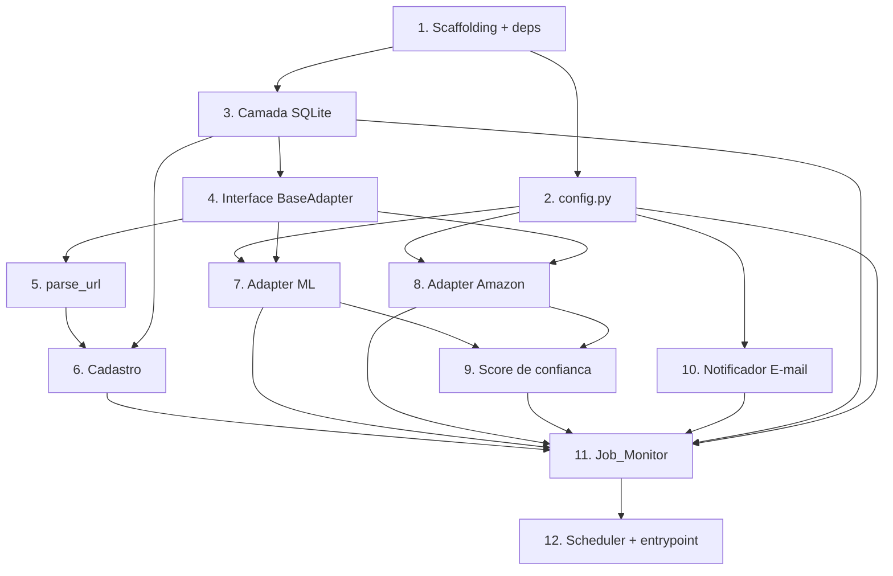

# Implementation Plan

Plano de implementação incremental e orientado a testes para o Rastreador de
Preços com IA (MVP). Cada tarefa referencia os requisitos e/ou propriedades de
correção que satisfaz. Todo I/O externo (API do Mercado Livre, scraping da
Amazon, envio de e-mail via SMTP) é mockado nos testes — nunca há rede real em CI.

- [x] 1. Estruturar o projeto e as dependências
  - Criar a árvore de diretórios conforme `structure.md` (`src/adapters/`, `src/db/`, `src/jobs/`, `src/notificacao/`, `src/confianca/`, `tests/test_adapters/`, `tests/test_jobs/`).
  - Criar `requirements.txt` com Python 3.11+ deps: `playwright`, `schedule`, `httpx` (ou `requests`), `pytest`, `hypothesis`.
  - Criar `.env.example` documentando apenas os nomes das 8 chaves (ML_CLIENT_ID, ML_CLIENT_SECRET, ML_REDIRECT_URI, ML_ACCESS_TOKEN, ML_REFRESH_TOKEN, EMAIL_REMETENTE, EMAIL_SENHA_APP, EMAIL_DESTINATARIO) com valores vazios/fictícios, e adicionar `.env` ao `.gitignore`.
  - _Requisitos: 7.2_

- [ ] 2. Implementar a configuração (`src/config.py`)
  - [x] 2.1 Ler as 7 variáveis de ambiente obrigatórias, sem valores default embutidos, e validar presença/não-vazio na inicialização.
    - Se uma chave obrigatória estiver ausente/vazia, interromper a inicialização e logar qual chave falta.
    - Expor parâmetros configuráveis com defaults: `Intervalo_Minimo` (default 4h, mínimo 1h), frequência do job (default 4h), timeout de consulta (default 30s), intervalo de atraso da Amazon (default 2–8s).
    - _Requisitos: 7.1, 7.3, 3.4, 3.5, 3.6, 3.7_
  - [x] 2.2 Escrever testes de validação de config (`tests/test_config.py`).
    - Casos: todas presentes → ok; chave ausente → interrompe e loga a chave; validação de que `.env.example` lista as 7 chaves.
    - _Requisitos: 7.1, 7.2, 7.3_

- [x] 3. Implementar a camada de dados SQLite (`src/db/`)
  - [x] 3.1 Definir as entidades em `src/db/models.py` (Produto, ProdutoSite, HistoricoPreco, HistoricoReputacao) e o schema/migração inicial em `src/db/database.py` conforme o SQL do design (UNIQUE(site,item_id), preço como TEXT/Decimal, timestamps ISO-8601 UTC, índices por (produto_site_id, coletado_em)).
    - _Requisitos: 1.6, 2.1, 3.2, 6.3_
  - [x] 3.2 Implementar acessores append-only: `inserir_historico_preco`, `inserir_historico_reputacao`, `obter_ultimo_preco` (maior `coletado_em`, desempate por maior `id`), `listar_produto_site`, `associar_produto`, `desassociar_produto`. Não expor update/delete de histórico.
    - _Requisitos: 2.3, 2.5, 3.2, 4.1, 6.3_
  - [x] 3.3 Escrever teste property-based de "último preço por timestamp" (Property 4).
    - `# Feature: rastreador-precos-mvp, Property 4` — para qualquer sequência não vazia de HistoricoPreco, o preço atual é o de maior `coletado_em` (desempate por `id`). Usar SQLite `:memory:`.
    - _Requisitos: 2.3, 4.1; Property 4_
  - [x] 3.4 Escrever teste property-based do invariante append-only (Property 5).
    - `# Feature: rastreador-precos-mvp, Property 5` — para qualquer sequência de operações (inserções, associar/desassociar), a contagem de registros de histórico nunca diminui e nenhum registro é alterado.
    - _Requisitos: 2.5, 3.2, 4.6, 6.3; Property 5_

- [x] 4. Definir a interface comum de adapter (`src/adapters/base.py`)
  - [x] 4.1 Implementar o enum `Site` e as dataclasses `ItemRef`, `PrecoResult`, `ReputacaoResult`, e a classe abstrata `BaseAdapter` (`parse_url` staticmethod, `buscar_preco`, `buscar_reputacao_vendedor`).
    - Convenção: `buscar_preco`/`buscar_reputacao_vendedor` nunca lançam; retornam `sucesso=False` com `erro` preenchido. Nenhum adapter importa outro.
    - _Requisitos: 3.3, 6.6_

- [x] 5. Implementar o parsing de URL nos adapters
  - [x] 5.1 Implementar `MercadoLivre.parse_url` (regex `MLB\d+`, domínios mercadolivre/mercadolibre, normaliza maiúsculas) e `Amazon.parse_url` (ASIN `[A-Z0-9]{10}` em `/dp/` ou `/gp/product/`). Retornar `None` quando não casar.
    - _Requisitos: 1.1, 1.2, 1.3, 1.4_
  - [x] 5.2 Escrever teste property-based de round-trip de parsing (Property 1).
    - `# Feature: rastreador-precos-mvp, Property 1` — gerar item_ids MLB e ASINs válidos, montar URL, parsear e recuperar o mesmo id e site.
    - _Requisitos: 1.1, 1.2, 1.6; Property 1_
  - [x] 5.3 Escrever teste property-based de rejeição de URLs inválidas (Property 2).
    - `# Feature: rastreador-precos-mvp, Property 2` — URLs vazias, >2048 chars, domínio não suportado, ou site suportado sem id válido → rejeitadas; nenhuma entrada persistida.
    - _Requisitos: 1.3, 1.4; Property 2_

- [x] 6. Implementar o cadastro de produto (registration)
  - [x] 6.1 Implementar a função de cadastro que roteia a URL para o `parse_url` correto por site, rejeita URL inválida/duplicada e persiste exatamente uma entrada ProdutoSite em sucesso (dedup via UNIQUE(site,item_id)).
    - _Requisitos: 1.3, 1.4, 1.5, 1.6_
  - [x] 6.2 Escrever teste property-based de idempotência/dedup do cadastro (Property 3).
    - `# Feature: rastreador-precos-mvp, Property 3` — cadastrar o mesmo (site, item_id) N vezes resulta em exatamente uma entrada; repetições rejeitadas como duplicata.
    - _Requisitos: 1.5; Property 3_

- [x] 7. Implementar o Adapter Mercado Livre (`src/adapters/mercado_livre.py`)
  - [x] 7.1 Implementar o cliente OAuth2: chamadas autenticadas com Bearer token; ao detectar token expirado, renovar via `refresh_token` (`grant_type=refresh_token`) em até 30s e repetir a chamada; rotacionar o refresh token em memória; após 3 falhas de refresh, logar, sinalizar reautenticação manual observável e preservar a config.
    - _Requisitos: 7.4, 7.5_
  - [x] 7.2 Implementar `buscar_preco` (`GET /items/{item_id}` para título/seller_id + endpoint de preço de venda encapsulado em `_obter_preco_venda`) e `buscar_reputacao_vendedor` (`GET /users/{seller_id}` → mapear `level_id`, `power_seller_status`→selo, `transactions.ratings.negative`→% reclamações).
    - _Requisitos: 3.1, 6.1_
  - [x] 7.3 Escrever testes (mockados) do adapter ML: parsing de resposta `/items` e `seller_reputation`, fluxo 401→refresh→retry, e falha de refresh 3x → sinal de reautenticação.
    - _Requisitos: 6.1, 7.4, 7.5_

- [x] 8. Implementar o Adapter Amazon (`src/adapters/amazon.py`)
  - [x] 8.1 Implementar o gerador de atraso aleatório configurável (default 2–8s) e a estratégia de rate limiting/CAPTCHA (loga e desiste no ciclo, retornando `sucesso=False`; nunca insiste imediatamente).
    - _Requisitos: 3.7_
  - [x] 8.2 Implementar `buscar_preco`/`buscar_reputacao_vendedor` via Playwright (headless), extraindo preço, nota média, número de avaliações e responsável pela venda/entrega; seletores centralizados; ausência de seletor → sinal indisponível (não crash).
    - _Requisitos: 6.2_
  - [x] 8.3 Escrever teste property-based do atraso da Amazon (Property 12) e testes (mockados, Playwright mockado) de parsing de HTML e de bloqueio/CAPTCHA.
    - `# Feature: rastreador-precos-mvp, Property 12` — o atraso gerado está sempre em `[min, max]` para qualquer intervalo configurado.
    - _Requisitos: 3.7, 6.2; Property 12_

- [x] 9. Implementar o score de confiança (`src/confianca/score.py`)
  - [x] 9.1 Implementar as fórmulas determinísticas por site (ML: nível/selo/reclamações; Amazon: nota/volume/vendedor) com `clamp` em [0,100]; retornar "indisponivel" quando um sinal obrigatório faltar. Coeficientes/mapeamentos em constantes.
    - _Requisitos: 6.4, 6.5_
  - [x] 9.2 Escrever teste property-based de bounds/indisponibilidade/determinismo do score (Property 9).
    - `# Feature: rastreador-precos-mvp, Property 9` — sinais completos → valor em [0,100]; sinal obrigatório faltando → "indisponivel"; mesma entrada → mesmo resultado.
    - _Requisitos: 6.4, 6.5; Property 9_

- [x] 10. Implementar o notificador por e-mail (`src/notificacao/email.py`)
  - [x] 10.1 Implementar `calcular_percentual` (((novo−anterior)/anterior)×100, 2 casas; rótulo subida/queda) e `montar_mensagem` (nome, preço anterior/novo, %, link; comparação entre sites quando ≥2 ProdutoSite; resumo de reputação ou "reputação indisponível").
    - _Requisitos: 5.1, 5.2, 5.3, 5.4, 5.5_
  - [x] 10.2 Implementar `enviar_notificacao` via SMTP/Gmail (smtplib nativo, STARTTLS em smtp.gmail.com:587, timeout 15s, até 3 tentativas com backoff); em falha, logar com id do ProdutoSite e não bloquear (fallback local), sem reverter históricos.
    - _Requisitos: 5.6_
  - [x] 10.3 Escrever teste property-based do percentual (Property 7) e teste property-based do conteúdo da mensagem (Property 8), mais teste (mockado, smtplib) de falha do envio de e-mail.
    - `# Feature: rastreador-precos-mvp, Property 7` e `# Feature: rastreador-precos-mvp, Property 8`.
    - _Requisitos: 5.1, 5.2, 5.3, 5.4, 5.5, 5.6; Property 7, 8_

- [x] 11. Implementar a orquestração do Job_Monitor (`src/jobs/monitor.py`)
  - [x] 11.1 Implementar `detectar_mudanca` (comparação Decimal exata contra o último preço; sem anterior ou igual → sem mudança; diferente → mudança, subida ou queda).
    - _Requisitos: 4.2, 4.3, 4.4, 4.5_
  - [x] 11.2 Implementar `executar_ciclo`: iterar ProdutoSite; respeitar Intervalo_Minimo; consultar preço com timeout; tratar preço inválido (não compara/não notifica/preserva histórico); persistir HistoricoPreco; detectar mudança; buscar reputação + persistir HistoricoReputacao + calcular score; notificar só na mudança; isolar erros por item via try/except (uma falha não interrompe os demais).
    - _Requisitos: 3.1, 3.2, 3.3, 3.4, 3.6, 4.1, 4.6, 6.3, 6.5, 6.6, 5.6_
  - [x] 11.3 Escrever teste property-based de detecção de mudança (Property 6).
    - `# Feature: rastreador-precos-mvp, Property 6` — notifica sse existe preço anterior e o novo difere (Decimal exato); sem anterior ou igual → não notifica.
    - _Requisitos: 4.2, 4.3, 4.4, 4.5; Property 6_
  - [x] 11.4 Escrever teste property-based de isolamento de erro (Property 10).
    - `# Feature: rastreador-precos-mvp, Property 10` — com um subconjunto arbitrário de consultas falhando, os itens bem-sucedidos são processados e nenhum item interrompe os demais. Adapters mockados.
    - _Requisitos: 3.3, 6.6; Property 10_
  - [x] 11.5 Escrever teste property-based do Intervalo_Minimo (Property 11).
    - `# Feature: rastreador-precos-mvp, Property 11` — consulta ocorre sse `now − t_last >= Intervalo_Minimo`.
    - _Requisitos: 3.4; Property 11_
  - [x] 11.6 Escrever testes de exemplo/integração: roteamento de adapter por site (3.1), timeout de consulta (3.6), transições de agrupamento single-site↔multi-site (2.1, 2.2, 2.4, 2.6).
    - _Requisitos: 3.1, 3.6, 2.1, 2.2, 2.4, 2.6_

- [x] 12. Conectar o agendador e o entrypoint
  - [x] 12.1 Registrar `executar_ciclo` no `schedule` com a frequência configurável (default 4h) e criar o entrypoint da aplicação que valida a config na inicialização e inicia o loop do agendador.
    - _Requisitos: 3.5, 7.3_
  - [x] 12.2 Escrever teste de registro do job no scheduler (mockado; sem sleep real).
    - _Requisitos: 3.5_

## Task Dependency Graph

